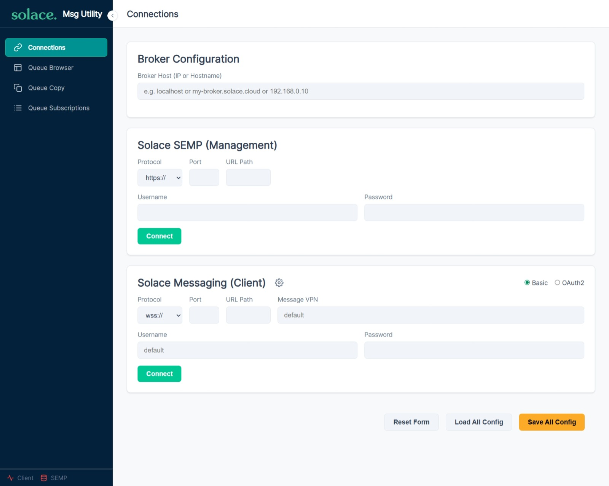
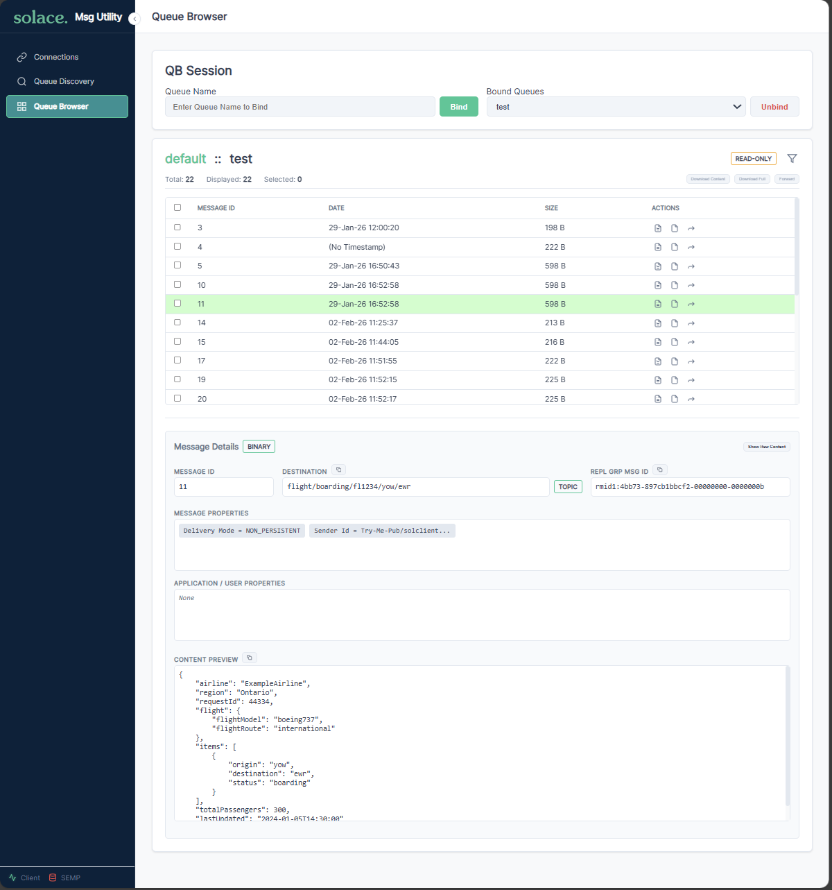
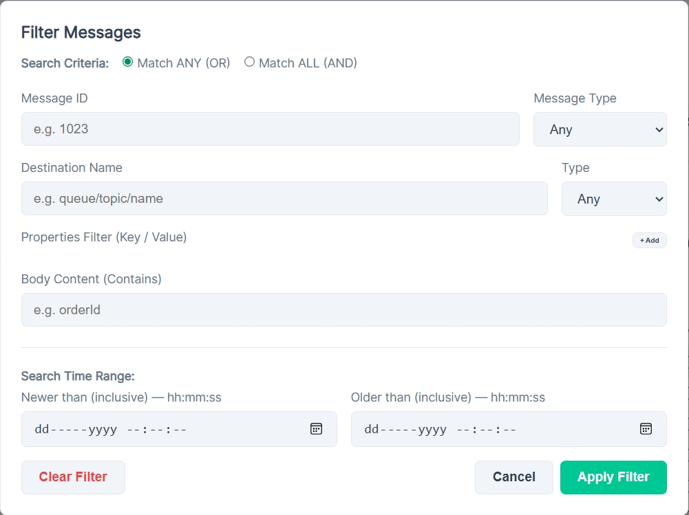
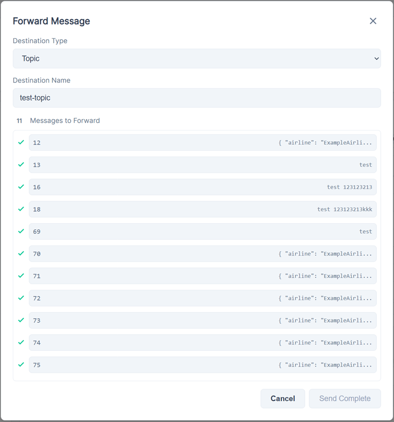
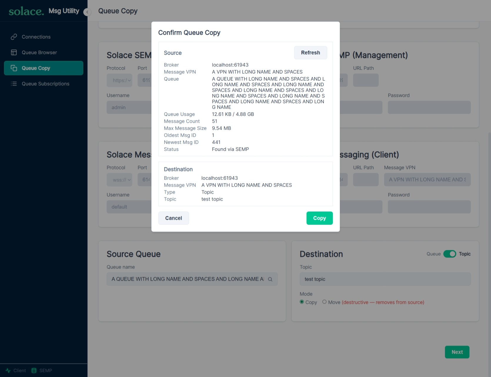
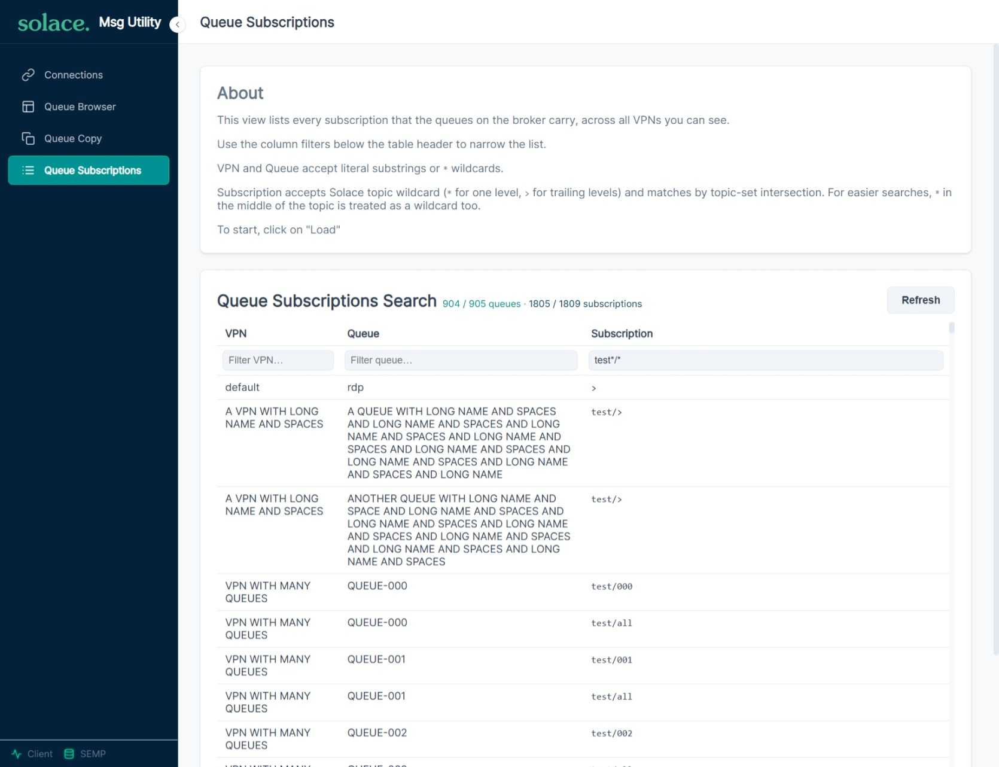

# User Guide

## Overview

Solace Message Utility is a browser-based tool for managing Solace PubSub+ Event Brokers. It runs as a single HTML page — no installation required beyond a web browser and network access to your broker.

The interface has a **sidebar** on the left for navigation and a **main content area** on the right. The available modules are:

1. **Connections** — Configure and manage broker connections
2. **Queue Browser** — Inspect, filter, forward, delete, and download messages
3. **Queue Copy** — Copy messages from a source queue to a destination queue (same broker or cross-broker)
4. **Queue Subscriptions** — Search every queue subscription on the broker by VPN, queue, or topic

---

## Module 1: Connections

This is the first screen you see. It manages two independent connections.



> **Both connections must use the same hostname or IP address.** The Broker Host field is shared between the Solace Client and SEMP connections to keep configuration consistent and reduce errors.
>
> Connection status indicators are shown at the bottom-left of the sidebar (see [Status Indicators](#status-indicators) below).

### Solace Client Connection (Web Messaging)

This connection uses the Solace Web Messaging protocol (WebSocket) to communicate with the broker for message operations (browsing, forwarding, deleting).

**Fields:**
| Field | Description | Example |
|-------|-------------|---------|
| Broker Host | IP address or hostname of your broker | `my-broker.solace.cloud`, `192.168.0.10` |
| Protocol | `ws://` (unencrypted) or `wss://` (TLS) | `wss://` (recommended) |
| Port | WebSocket port | `8008` (ws) or `1443` (wss) |
| URL Path | Optional path appended after the port (e.g. when the broker sits behind a reverse proxy). Leave blank for a direct broker URL. | `/solace`, `/ws` |
| Message VPN | The Solace VPN to connect to | `default` |
| Username | Client username | `default` |
| Password | Client password or OAuth2 token | |

**Auth Modes:**
- **Basic** — Standard username/password authentication
- **OAuth2** — Token-based authentication (the Username field becomes "Client ID" and Password becomes "Access Token")

**Advanced Settings** (gear icon):
| Setting | Default | Description |
|---------|---------|-------------|
| Connect Retries | 0 | Number of times to retry initial connection |
| Connect Timeout | 3000ms | How long to wait for connection |
| Reconnect Retries | 1 | Retries after disconnect (-1 = infinite) |
| Reconnect Wait | 3000ms | Delay between reconnect attempts |
| Max Messages per Queue | 100 | Per-queue message cap (1–10 000). When a queue exceeds this, the oldest message is silently dropped from the in-memory store and the UI as new messages arrive. Increasing this lets you keep more history at the cost of browser memory; decreasing it limits memory use during long browse sessions. The cap takes effect when you click **Connect** (the live input is read at connect time — no Save required). |
| Client Name Identifier | (auto-generated UUID) | Identifier embedded into the broker session's `clientName` property. Editable to any alphanumerics or `!@#$%^&*-=_+/.,` symbols (max 100 chars). Surrounding whitespace is trimmed on blur; if the field is left blank, a fresh UUID is filled in automatically. The full `clientName` sent to the broker is composed at Connect time as `SolMsgUtil/YYYYMMDDHHMMSS/{identifier}`, so each session is distinguishable in broker tooling. |

**SSL/TLS Certificate Trust:**
If connecting over `wss://` to a broker with a self-signed certificate, the browser will block the connection. A helper dialog appears with instructions to trust the certificate:
1. Click "Open Broker URL" to open the broker in a new tab
2. Accept the certificate warning in that tab
3. Close the tab and reconnect

### SEMP Connection (Management API)

This connection uses the SEMP v2 REST API for management operations (discovering VPNs and queues).

> [!IMPORTANT]
> SEMP connections are made over HTTP/HTTPS. Your Solace Event Broker must allow **CORS** for this to function. Future versions may include additional connection methods that do not require CORS.

> [!NOTE]
> SEMP interactions are REST calls rather than a persistent connection — each action triggers a new HTTP request using the configured credentials. The "connection" abstraction is preserved for UI consistency with the other modules. Future releases may add alternative SEMP connection methods (e.g. via the client session or OAuth2).

**Fields:**
| Field | Description | Example |
|-------|-------------|---------|
| Protocol | `http://` or `https://` | `https://` |
| Port | SEMP port | `8080` (http) or `1943` (https) |
| URL Path | Optional path appended after the port and before `/SEMP/v2/...` (e.g. when SEMP is exposed behind a reverse proxy). Leave blank for a direct SEMP URL. | `/api`, `/management` |
| Username | SEMP admin username | `admin` |
| Password | SEMP admin password | |

The SEMP connection shares the same Broker Host as the Solace client connection.

### Connection Profiles

- **Save All Config** — Saves all connection fields to browser localStorage. If localStorage is unavailable or its quota is exceeded, an error toast is shown instead of a success toast.
- **Load All Config** — Restores previously saved fields
- **Reset Form** — Clears all fields back to defaults

### Status Indicators

The sidebar shows two colored dots:
- **Client** indicator — green when Solace client is connected
- **SEMP** indicator — green when SEMP management API is connected

---

## Module 2: Queue Browser

Requires an active **Solace Client connection**. If disconnected, a "Connection Required" message is shown.



### Binding to a Queue

1. Enter a queue name in the "Queue Name" input
2. Click **Bind** (or press Enter)
3. A `Queue "<name>" bound` toast confirms the bind, the queue appears in the "Bound Queues" dropdown, and messages begin arriving in real-time

You can bind up to **3 queues simultaneously**. Switch between them using the dropdown. Each queue maintains its own message store independently. The per-queue moving-window cap is set by **Max Messages per Queue** in the Connections module's Advanced Settings.

To stop receiving messages, select a queue and click **Unbind**.

### Message Table

Messages are displayed in a scrollable table:

| Column | Description |
|--------|-------------|
| Checkbox | Select individual messages for bulk operations |
| Message ID | The Guaranteed Message ID assigned by the broker |
| Date | Sender timestamp (or "No Timestamp" if not set) |
| Size | Message size in bytes |
| Actions | Per-row buttons: Download Content, Download Full, Forward, Delete |

**Select All** checkbox in the header selects/deselects all visible messages.

The info bar shows counts: **Total** (all messages in store), **Displayed** (after filtering), **Selected** (checked messages).

### Message Details

Click any row to see its details in the panel below:

- **Message ID** — Guaranteed message ID
- **Destination** — Topic or queue name with a badge showing the type
- **Replication Group Message ID** — If available from the broker
- **Message Properties** — Standard Solace properties (Delivery Mode, TTL, Priority, Correlation ID, etc.)
- **Application Properties** — User-defined key/value properties set by the publisher
- **Content Preview** — The message payload (text, binary, SDT)
- **Show Raw Content** — Opens a modal with the full raw message dump

Copy buttons next to Destination, Repl Grp Msg Id, and Content allow one-click clipboard copy.

### Filtering Messages

Click the **filter icon** in the header bar to open the filter modal.



**Filter Criteria:**
| Field | Description |
|-------|-------------|
| Search Criteria | **Match ANY (OR)** or **Match ALL (AND)** |
| Message ID | Filter by message ID (contains) |
| Message Type | Any, Text, Binary, Map, or Stream |
| Destination Name | Filter by destination (contains, supports `*` wildcard) |
| Destination Type | Any, Topic, or Queue |
| Body Content | Filter by payload content (contains, supports `*` wildcard) |
| Properties Filter | Add key/value rows to filter by standard or application properties |

The property filter supports autocomplete for standard Solace properties (App Msg Id, Cache Id, Corr Id, Delivery Count, Delivery Mode, HTTP Encoding, HTTP Type, Priority, Reply To, Sender Id, SeqNumber, TTL, TopicSeqNum).

**Wildcard semantics:**
- `*` matches any sequence of characters (including spaces and symbols).
- For **Body Content**, the wildcard is auto-applied — entering `match text` behaves as `*match text*` (substring contains-match).
- For Message ID and Destination Name, wildcards are explicit — use `*` where you want a wildcard. Without one, the filter is an exact match.

- **Apply Filter** — Filters the displayed messages (original data is preserved)
- **Clear Filter** — Removes all filters and shows all messages
- **Cancel** — Closes the modal without applying

Modals (filter, forward, raw content, settings, certificate trust helper) can also be dismissed by pressing **Escape** or clicking outside the modal box.

### Forwarding Messages

Forward one or more messages to a different destination.



> **Forwarded messages are sent in PERSISTENT delivery mode** to ensure delivery confirmation, even if the original message was DIRECT. The forwarded message is constructed as a new message that copies all properties from the original (see the property-preservation note below).


1. Select messages using checkboxes, then click **Forward** in the toolbar (bulk forward), OR click the forward button on an individual row
2. The Forward modal opens showing the messages queued for forwarding
3. Choose a **Destination Type** and (where applicable) enter a **Destination Name**:
   - **Topic** — fan-out to subscribers of the named topic
   - **Queue** — point-to-point delivery to the named queue
   - **Original Destination** — each message is forwarded to the destination it was originally received on. The Destination Name input is disabled in this mode (the per-message destination is read from each message's broker metadata)
4. Click **Send**

While the send is running, both the type and name inputs are locked and the button shows **Sending...**. They re-enable when the batch reaches a terminal state.

Each message shows a status indicator:
- **QUEUED** — Waiting to be sent
- **SENDING** — In transit
- **SUCCESS** — Broker acknowledged receipt
- **FAILED** — Broker rejected the message (reason shown), the client disconnected mid-send, or the broker did not acknowledge within 30 seconds ("Timed out waiting for broker acknowledgement.")

If any messages fail, the **Send** button changes to **Resend failed messages (N)** with N being the failure count. Clicking it retries only the failed items — successful messages keep their green check and aren't re-forwarded. You can switch the destination type or name (or to/from Original Destination) before clicking resend, so retries can target a different destination than the initial send.

Forwarded messages preserve all original properties (application message ID, correlation ID, delivery mode, priority, TTL, reply-to, user properties, etc.).

> **Note:** Closing the Forward modal (Close button, X, Escape, or backdrop click) discards the in-modal queue. Reopening from the message list rebuilds it with new tracking IDs — pending ACKs from the previous attempt won't update the new view.

### Deleting Messages

> [!IMPORTANT]
> Delete is available only when the queue binding has **read-write** permissions (Consume, Modify, Delete, Owner). On read-only queues the delete button is hidden from each row entirely.

- **Single delete**: Click the delete button on a message row. A confirmation dialog appears.
- **Bulk delete**: Select messages with checkboxes, then click **Delete** in the toolbar. A confirmation dialog shows the count.

Deleted messages are removed from the broker queue and the UI immediately.

### Downloading Messages

Two download formats are available:

- **Download Content** — Exports only the message payload. Each message becomes a separate file in a ZIP archive named `solace-message-{id}`. If the payload is a known binary format (PDF, PNG, DOCX, etc.) the saved file has no extension — rename it before opening.
- **Download Full** — Exports the complete message as JSON including all properties, headers, destination, timestamp, and content. Each message becomes `solace-message-{id}-full.json` in a ZIP archive. The JSON shape is:

  ```json
  {
    "messageProperties":     { ... standard Solace properties + destination + messageType ... },
    "applicationProperties": { ... user/custom properties ... },
    "payload":               "..."
  }
  ```

  > [!IMPORTANT]
  > This JSON structure is proprietary to this tool and may change in future releases. If you build automation against it, version-pin the tool or migrate when the format changes.

Both are available as per-row buttons and as bulk toolbar buttons (when messages are selected).

Requires JSZip to be loaded (included in the standard deployment).

### Keyboard Shortcuts

- **Enter** in the Queue Name input — triggers Bind
- **Enter** in the Forward Destination input — triggers Send

---

## Module 3: Queue Copy



Requires an active **primary Solace connection**. If the primary client is disconnected, a "Connection Required" message is shown.

Queue Copy moves or copies messages from a source queue to a destination queue (or topic). The destination can be on the **same broker** as the primary connection or on a **different broker** entirely — cross-broker copy is fully supported.

### Two-column layout

The form is split into Source (left, read-only mirror of the primary connection) and Destination (right, editable):

- **Source** cards mirror the primary Broker / SEMP / Client values. Only the Source Queue field is editable. Each card has an **Edit in Connections** button that jumps to the Connections module for credential changes.
- **Destination** cards accept broker host, SEMP creds, Solace client creds, and the destination target. Two shortcuts live at the top of the Destination Broker card:
  - **Same Solace Broker as source** — destination reuses the primary host + SEMP creds.
  - **Same Message VPN as source** — destination reuses the primary VPN + Solace creds (implies Same Broker).

When Same-VPN is enabled, the destination uses the primary Solace session directly — no second connection is needed.

### Destination target

Choose one of two targets:

- **Queue** — point-to-point delivery; pick an existing destination queue (or type the name). A **Pick** button opens a queue selector populated via SEMP.
- **Topic** — fan-out to subscribers of the named topic.

Each run is either a **Copy** (messages stay on the source) or a **Move** (messages are removed from the source after successful publish).

### Important considerations

The modal's top card lists operational constraints:

- Don't run this on a live queue with active publishers/consumers.
- The run stops on the first error (e.g. quota exhausted, permission denied, destination rejects).
- The module snapshots the source queue before starting so the run is bounded.
- Destination must have sufficient spool quota, equal-or-larger max-message-size, and ingress enabled.
- Source queue must have egress enabled.

### Confirm Queue Copy modal

Clicking **Start Copy** opens a two-phase modal:

1. **Verify** — SEMP v1 is probed for the source queue's count, size, quota, max-msg-size, oldest-msg-id, newest-msg-id, and access-type. If SEMP is unavailable, the module falls back to a temporary QueueBrowser bind that accumulates count + oldest/newest IDs from the browsed messages and reads the access-type from the SDK.
2. **Run** — after you confirm, messages stream from source to destination. Progress counters update live; a per-message ACK is awaited before the next publish. In Move mode, each source message is removed immediately after its publish ACK lands (not batched at the end). The run stops when the recorded newest-msg-id is reached, then completes.

The snapshot taken in step 1 is treated as immutable — the engine copies oldest → newest in one pass, then stops. Messages that arrive on the source *after* verify are out of scope for the current run.

**Empty queue:** if verify reports zero messages, a red "Queue is empty" banner appears and the Copy/Move button stays disabled.

**Move on read-only:** if you select Move and the source queue's access type is read-only, a red "Move requires consume permission" banner appears and the button is disabled. Switch to Copy mode to proceed (Copy doesn't need consume permission).

**No access:** if the source queue's `<others-permission>` is `No-Access` AND your client session username doesn't match the queue's `<owner>`, a red "You don't have access to this queue" banner appears and Both Copy and Move are blocked. Re-connect as the queue owner or as a user with at least Read-Only permission, then click Refresh.

**Owner override.** When SEMP is connected and the queue's `<owner>` matches your client session username, you have full access regardless of the queue's `<others-permission>` value. The modal lifts the effective access type to read-write automatically — both Copy and Move are enabled. (The QueueBrowser-fallback path doesn't need an explicit owner check; the SDK already factors owner status into the permission it reports.)

**Stop conditions and statuses.** The run reports one of three final statuses:
- **Completed** — every message from oldest to newest was copied/moved successfully.
- **Cancelled** — you clicked Cancel; the modal shows the partial count.
- **Failed** — surfaces with a specific error message. The most common causes:
    - *Source drift:* the first browsed message ID doesn't match the recorded oldest. The queue contents changed between verify and run.
    - *Recorded newest consumed:* a message ID greater than the recorded newest arrived before the engine reached the recorded newest itself, implying someone else consumed the recorded newest message before our run.
    - *Count mismatch:* the run drained without reaching the recorded count. Messages were drained from the source mid-run by another consumer.
    - *Publish error:* the destination broker rejected a publish (full quota, missing permission, max-message-size exceeded, etc.).

### Refreshing source stats inside the modal

The Confirm Queue Copy modal has a **Refresh** button next to the Source heading. After the initial verify probe completes (whether successful or not), click Refresh to re-fetch the source queue's count, size, oldest/newest message IDs, etc., before clicking Copy. The button is disabled while a probe is in flight and hidden once the copy run starts — drift recovery during the run is still cancel-and-re-click-Next.

---

## Module 4: Queue Subscriptions



Requires an active **SEMP connection**. If SEMP is not connected, a "Connection Required" message is shown.

This view lists every `(VPN, queue, topic-subscription)` triple visible to your SEMP user — useful for answering "which queues subscribe to topic X?" without having to walk every queue manually. Queues that have zero topic subscriptions are omitted.

### Workflow

1. **Click Load** to fetch the full subscription list from the broker. The button label flips to **Refresh** once the load completes; click it again at any time to re-fetch.
2. **Filter the table** by typing into one or more of the column-filter inputs below the column headers. Filters are AND-combined — a row must match every non-empty filter to render.
3. With all three filters empty, the table prompts *"Type in any column above to start searching."* — the filtered table is only rendered once you start typing, so the page never dumps thousands of rows by accident.

### Filter syntax

| Column | Match rule |
|---|---|
| **VPN** / **Queue** | Case-insensitive substring by default — `def` matches `default`. Type `*` anywhere in the input to switch to anchored wildcard matching — `def*` matches names starting with `def`, `*ult` matches names ending with `ult`, `def*ult` matches names that start with `def` and end with `ult`. |
| **Subscription** | Solace topic-set intersection. Both your input and the stored subscription may use Solace wildcards: `*` matches one level, `>` matches one or more trailing levels. The row is included when the two patterns describe overlapping topics. So typing `orders/new` matches a stored subscription `orders/*`; typing `orders/>` matches `orders/new/details`; typing `topic` matches a stored subscription `*`. |

### Caching

The loaded subscription list is held in memory for the session. Subsequent filter changes never re-hit the broker. Click **Refresh** to re-fetch (e.g. after a queue or subscription was added/removed). The cache is dropped automatically if your SEMP connection drops.

---

## Tips

- **Cross-module flow**: Once the primary connection is up, the **Pick** buttons in Queue Browser and Queue Copy let you select a queue from a SEMP-driven dropdown without leaving the current module.

- **Connection profiles**: Save your connection settings before closing the browser. They persist in localStorage and can be restored with one click.

- **Multiple queues**: Bind up to 3 queues and switch between them. Messages accumulate independently per queue. Unbinding a queue removes its messages from the UI but the data stays in memory until you bind again or disconnect.

- **Filtering is non-destructive**: Filters only change what is displayed. All messages remain in memory. Clear the filter to see everything again.

- **Wildcard search**: Use `*` in content and destination filters for glob-style matching (e.g., `order*` matches "orderCreated", "orderUpdated").

- **Verbose troubleshooting logs**: append `?logLevel=DEBUG` to the URL (e.g. `dist/index.html?logLevel=DEBUG`) to surface fine-grained flow logs in DevTools. Accepted values are `DEBUG`, `INFO` (default), `WARN`, `ERROR`, and `SILENT` (mutes everything). Invalid values fall back to the default.

- **Hosted (gateway) deployment**: when the bundle is served by the optional Go reverse-proxy in `go-web-proxy/`, the broker is internal to the gateway and unreachable from the browser. All broker URLs are automatically tunnelled through the gateway — you still enter the broker's protocol/host/port/path as if connecting directly, and the page displays those same values; the rewrite to the gateway URL is transparent. The PWA detects the mode at startup by probing the gateway-only `/hosted` endpoint, so a standalone deployment (no gateway) keeps working unchanged.

---

## Shipped Variants

The project ships four HTML variants, all available from each [GitHub Release](https://github.com/SolaceLabs/solace-msg-utility/releases):

| File | Variant | Use |
|------|---------|-----|
| `index.html` | **Full** (default) | Production deployment — every module: Connections, Queue Browser, Queue Copy, Queue Subscriptions |
| `min.html`   | **Minimal**        | Stripped-down variant — only Connections + Queue Browser. Smaller bundle for environments that don't need the copy/move or subscription-browser modules |
| `no-payload.html` | **No-payload** | Same as Full, except the Queue Browser never shows or exports the message **body**. The Content Preview, Show Raw Content, Copy Content, Download Content, Download Full, and Body-Content filter are all removed; Forward, Delete, all metadata, and the other filters remain. Use where message bodies must not be visible to the operator. |
| `mock.html`  | Full + mocks       | Interactive demo (see [Demo Mode](#demo-mode-mockhtml)) |

Each HTML file is self-contained for the app code (CSS and JS are inlined), but **two vendor scripts are not bundled and must be downloaded separately**:

- **`solclient.js`** — Solace Web Messaging SDK, required for any broker connection. Get it from the [Solace Developer Portal](https://solace.com/downloads/), npm (`solclientjs`), or your broker's web UI (`http://<broker>:8080/`).
- **`jszip.min.js`** — JSZip library, required for the Queue Browser's ZIP download feature. Get it from a CDN (`https://cdnjs.cloudflare.com/ajax/libs/jszip/3.10.1/jszip.min.js`), npm (`jszip`), or [https://stuk.github.io/jszip/](https://stuk.github.io/jszip/).

Place both files in the **same folder as the HTML**, or in a sibling **`js/`** subfolder — the shell tries both locations automatically. The same files serve all three HTML builds; you don't need a separate copy per variant.

> **What happens if a vendor file is missing:**
> - Without `solclient.js`, the app boots in a limited mode and shows a vendor-missing banner. Connection features will not work.
> - Without `jszip.min.js`, every other feature works normally; only ZIP download is disabled.

See [deployment.md](deployment.md#external-runtime-dependencies) for download sources and version requirements.

---

## Demo Mode (`mock.html`)

The project ships a self-contained demo build (`dist/mock.html`) that exercises every module without a real broker. It substitutes deterministic mock services for the Solace and SEMP clients and the queue-browser SDK calls, so you can walk the UI end-to-end on any machine with just a browser.

### Opening the demo

`mock.html` ships in every [GitHub Release](https://github.com/SolaceLabs/solace-msg-utility/releases) alongside `index.html`. Download it and open it directly in a browser — no server required, it's a single self-contained file.

(For developers building from source, `npm run build:mock` produces `dist/mock.html`; `npm run build` produces all three variants. See [developer-guide.md](developer-guide.md) for the full build workflow.)

### Connection values

The mock factories accept **only one host**: `broker.solace.com`. Any other hostname will surface a "Connection Failed" error so you can also see the failure paths.

**Solace Client connection:**

| Field | Value |
|-------|-------|
| Broker Host | `broker.solace.com` |
| Protocol | `wss://` (any value works) |
| Port | `8008` (any valid 1–65535 port) |
| URL Path | *(leave blank)* |
| Message VPN | `default` (any non-empty value) |
| Username | `default` (any non-empty value) |
| Password | `anything` (any non-empty value) |

Advanced settings can be left at their defaults.

**SEMP connection** (use the **same** Broker Host as above):

| Field | Value |
|-------|-------|
| Protocol | `https://` |
| Port | `1943` (any valid 1–65535 port) |
| URL Path | *(leave blank)* |
| Username | `admin` (any non-empty value) |
| Password | `admin` (any non-empty value) |

Click **Connect** on each section. Both status indicators in the sidebar should turn green.

### What's available after connecting

- **SEMP queue picker** (used by Queue Browser, Queue Copy, and Queue Subscriptions) returns six VPNs: `default`, `vpn-dev`, `vpn-prod`, `vpn-test-1`, `vpn-test-2`, `vpn-finance`. Each VPN reports the same five queues: `test-queue-1`, `test-queue-2`, `Q/ORDER/NEW`, `Q/ORDER/PROCESS`, `Q/LOGS/AUDIT`.
- **Queue Browser** can bind to **`test-queue-1`** or **`test-queue-2`** only. Other queue names (including `Q/ORDER/...`) will fail to bind. Each successful bind seeds 10–20 deterministic mock messages with mixed text/binary payloads, application properties, and varied destinations — enough to exercise filtering, forwarding, and downloading.
- **Queue Copy** mock returns canned verify results (15 messages, oldest=1000, newest=1014) and simulates a successful copy/move with deterministic ACK delays.
- **Queue Subscriptions** loads ~10 canned `(VPN, queue, topic)` rows across two pages (so the per-page render path is exercised). Mix of literal topics, `*`-wildcards, and `>`-wildcards — enough to exercise every column-filter rule.

### Failure-path hosts

To exercise error UI without leaving the demo:

| Host | What you see |
|------|--------------|
| Any host containing `untrust.com` (e.g. `foo.untrust.com`) | Synthetic "Certificate Not Trusted (Mock)" error with the SSL trust-helper link. Works on both Solace Client and SEMP. |
| Any host other than `broker.solace.com` (and not containing `untrust.com`) | "Connection Failed: Unable to connect to ..." for the Solace client; "Unable to connect to ..." for SEMP. |
